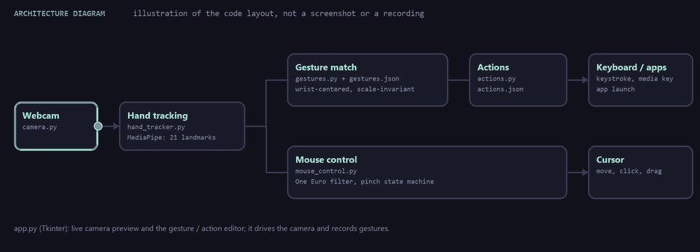
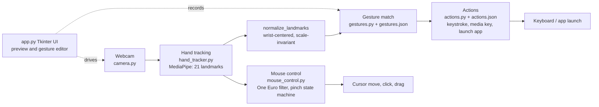

# MotionVision

[](https://github.com/darkspaz-v1/MotionVision/actions/workflows/ci.yml)

Control your Windows mouse with your webcam: move your hand to move the cursor, pinch to click, double-tap and hold to drag, and bind recorded hand poses to keystrokes, media keys, or app launches.

[Quick start](#quick-start) · [What it does](#what-it-does) · [How it works](#how-it-works) · [Demo](#demo) · [Tests and CI](#proof-tests-and-ci) · [Known limitations](#known-limitations) · [MIT license](LICENSE)



*The animation above is a drawn diagram of the code layout, not footage of the app running. See [Demo](#demo) below.*

## Quick start

**Prerequisites:** Windows 10/11, Python 3.11 or newer (CI runs 3.12 and 3.13), and a webcam.

```
python -m venv venv
venv\Scripts\python.exe -m pip install -r requirements.txt
```

Hand tracking needs MediaPipe's `hand_landmarker.task` model (about 7.8 MB). It is not committed to the repo. Download it into `models/`:

```
mkdir models
curl -L -o models\hand_landmarker.task https://storage.googleapis.com/mediapipe-models/hand_landmarker/hand_landmarker/float16/latest/hand_landmarker.task
```

Then start the app:

```
run.bat
```

Without the model file the app cannot start tracking. If tracking does nothing on a locked-down machine, see [Known limitations](#known-limitations).

## What it does

- **Move your hand to move the cursor.** The palm center (wrist plus four knuckle landmarks) is mapped to absolute screen coordinates and smoothed with a One Euro filter.
- **Pinch to click, double-tap and hold to drag.** Thumb + index pinch is a left click, thumb + middle is a right click; a second pinch that starts shortly after the first one's release presses the button and holds it until you let go.
- **Record your own gestures.** Capture a named hand pose in the Tkinter UI; it is stored in `gestures.json`.
- **Bind gestures to actions.** Each gesture can press a key or key combination, send a media key, launch a program, or toggle mouse mode (`actions.json`).

## How it works

- **MediaPipe HandLandmarker** returns 21 hand landmarks per frame from the webcam.
- `mouse_control.py` maps landmark positions to screen coordinates and runs the click/drag state
  machine.
- `gestures.py` records named poses into `gestures.json`; `actions.py` binds each to an action in
  `actions.json` — keystroke, media key, app launch, or toggling mouse mode.
- `app.py` is a Tkinter UI with a live camera preview and the gesture/action editor.



## Demo

**There is no real gesture-control footage in this repo yet.** The GIF at the top of this README is a
drawn architecture diagram (webcam → tracking → gesture matching/mouse control → actions), not a
screen recording. It illustrates the pipeline; it does not show the app being used.

A real screen recording of hand-to-cursor control — cursor tracking a hand, pinch-click, drag, and a
bound gesture firing an action — is planned but not yet captured. It needs a live webcam session on a
machine without Windows Application Control blocking MediaPipe (see [Known limitations](#known-limitations)),
so it has to be recorded by hand rather than generated. A shot list for that recording already exists
from an earlier review pass; it is not reproduced here to avoid drift between two copies — use that
existing list when capturing the footage, then drop the clip into `docs/media/` and swap it in as the
hero above the architecture diagram (kept, clearly labelled, as a secondary illustration).

## Problems that were actually hard

- **Timestamps must strictly increase.** MediaPipe's `detect_for_video()` raises if two frames carry
  the same millisecond, and naive `int(time.time() * 1000)` truncation hands back a duplicate at a
  fast tick rate. There is a regression test for exactly this.
- **Jitter.** Raw landmark positions shake far too much to point with, so cursor position is smoothed
  before it is used.
- **DPI and multiple monitors.** Screen coordinates are not what you first assume on a scaled display.
  Multi-monitor support is behind an explicit `MULTI_MONITOR` flag rather than on by default, because
  the naive version is worse than single-monitor for most setups.

## Proof: tests and CI

```
venv\Scripts\python.exe -m pip install -r requirements-dev.txt
venv\Scripts\python.exe -m pytest
```

**29 tests** across `test_mouse_control.py` (20), `test_gestures.py` (7) and `test_hand_tracker.py`
(2, exercising the real HandLandmarker rather than a mock).

**What actually runs where — this is not "29/29 everywhere":**

| Where | Tests that run | Tests that skip | Why |
|---|---|---|---|
| **GitHub Actions CI** (`.github/workflows/ci.yml`, Windows, Python 3.12 & 3.13) | 27 | 2 (`test_hand_tracker.py`) | CI runners have no webcam and no model file; `MOTIONVISION_SKIP_TRACKER_TESTS=1` is set explicitly so the two real-HandLandmarker tests skip instead of erroring. |
| **This development machine, as verified for this README** | 27 | 2 (`test_hand_tracker.py`) | Windows Application Control (WDAC / Smart App Control) blocks MediaPipe's native DLL here — see below — so the same two tests skip for a different, environment-specific reason, with the reason printed by `pytest -rs`. |
| **A machine with the model file present and no WDAC block** | 29 | 0 | The full suite, including real hand-tracking, runs and passes. |

In short: **27 tests pass in every environment**; the remaining 2 need both the downloaded model file
and a machine where MediaPipe's native library is allowed to load, and skip themselves cleanly
(never silently pass or fail) when either is missing. Run `pytest -rs` yourself to see exactly which
tests skipped and why on your machine. Set `MOTIONVISION_SKIP_TRACKER_TESTS=1` to skip them explicitly
(CI does this).

## Known limitations

- **Windows only, webcam required.** There is no recorded demo yet (see [Demo](#demo)), and the CI machines have no camera, so the live tracking path is only exercised on a real machine.
- **Sensitive to webcam quality and lighting.** MediaPipe's hand landmarks get noisier and can drop
  out under low light, backlighting, or a low-resolution/low-framerate webcam. Point the camera at a
  well-lit hand against a plain background for the most stable tracking; expect more jitter and missed
  detections outside that.
- **Multi-monitor is opt-in.** It is behind the `MULTI_MONITOR` flag in `mouse_control.py` and off by default (see above).
- **Windows Application Control can block tracking.**

On a machine with Windows Application Control (WDAC / Smart App Control) active, loading MediaPipe's
native library fails:

```
OSError: [WinError 4551] An Application Control policy has blocked this file
```

That makes `test_hand_tracker.py` skip itself (27 pass, 2 skipped) **and breaks hand tracking at runtime**, since it is the
same blocked library. If tracking does nothing, check App & browser control before suspecting the
camera or the model file.

## Troubleshooting

**Log file location:** `logs/motionvision.log` inside the project folder (rotating, 3 backups of 500 KB;
`logs/` is gitignored). Set the `MOTIONVISION_LOG_DIR` environment variable to put it elsewhere.
Failed actions, per-frame errors and cursor-release failures are recorded there; warnings and errors are
also printed to the console when you start the app with `run.bat`.

## License

MIT — see [LICENSE](LICENSE).
